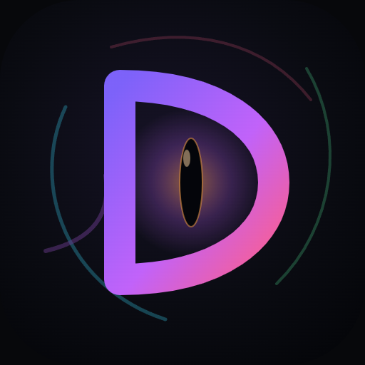
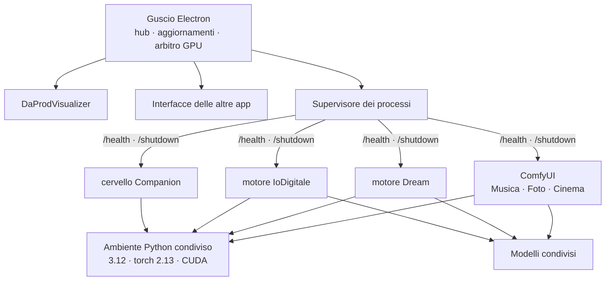

<div align="center">



# DaProd Suite

**I modelli AI che valgono la pena, montati per bene, a due clic di distanza.**

Musica, immagini, video, un avatar parlante e un companion che si ricorda di te.
Ogni scheda è un'esperienza completa che installi, usi e disinstalli quando vuoi.
Tutto sul tuo computer.

[](https://github.com/cammo22/DaProdSuite/releases)
[](LICENSE)
[](#requisiti)

</div>

---

<div align="center">

</div>

---

## A cosa serve

Esce un modello nuovo ogni settimana. Leggi che fa cose incredibili, vai a
provarlo, e ti ritrovi a clonare una repo, litigare con le versioni di CUDA,
scaricare venti gigabyte e scoprire dopo un'ora che ti serviva un'altra versione
di PyTorch. Quando finalmente parte, funziona da riga di comando.

**DaProd Suite è una vetrina dei modelli che valgono la pena**, montati per bene,
con tutte le loro funzioni, in un posto dove con due clic installi qualcosa che
ti fa fare cose divertenti.

Ogni scheda è **un'esperienza completa**: il modello, l'interfaccia fatta apposta
per lui, e i suoi trucchi già configurati. La installi, la usi, e se non ti serve
più la disinstalli e ti riprendi lo spazio. Niente ambienti da gestire, niente
comandi, niente file di configurazione.

E siccome girano tutte nello stesso posto, si parlano: il brano che generi con
una lo apri nell'altra senza esportare niente.

### Cosa c'è sotto

Perché due clic bastino, la suite si prende in carico le cose noiose una volta
sola per tutte le app:

| | |
|---|---|
| **Un ambiente solo** | Python e PyTorch installati una volta, 4 GB invece di 14,7 sparsi in quattro copie |
| **Modelli condivisi** | quello che serve a due app si scarica una volta |
| **Una GPU sola** | su 8 GB ci sta un modello per volta: la suite spegne il precedente invece di farti finire in out-of-memory |
| **Aggiornamenti** | la suite si aggiorna da sola, i modelli restano dove sono |
| **I tuoi risultati in comune** | brani, immagini e video in una libreria che tutte le app vedono |

Tutto in locale: nessun account, nessuna API, nessun dato che esce dal computer.

## Le sette app

| | App | Cosa fa | Modello |
|---|---|---|---|
| 🟣 | **DaProdVisualizer** | La tua musica diventa visualizzazioni reattive | — |
| 🩷 | **DaProdMusica** | Canzoni complete e cantate da una descrizione e un testo | MiniMax Music 3 (4 bit) |
| 🟠 | **DaProdFoto** | Immagini da prompt e ritocco con maschera | Anima Turbo · FLUX.2 Klein |
| 🟪 | **DaProdCinema** | Da una canzone al suo video musicale, scena per scena | MiniMax H3 |
| 🩵 | **DaProdDream** | Webcam, video o schermo trasformati in tempo reale | SD-Turbo |
| 🟢 | **DaProdCompanion** | Un compagno sul desktop che ti ascolta e si ricorda di te | un modello a scelta via LM Studio |
| 🟥 | **DaProd IoDigitale** | Il tuo avatar parlante: gli scrivi, ti risponde in video | SoulX-FlashHead |

## A che punto siamo

> **0.0.1 — le fondamenta ci sono, tre app sono dentro, e adesso si installa da sola.**
>
> Guscio, hub, installer, aggiornamenti automatici, arbitro della GPU e ambiente
> Python condiviso: **fatti e provati**. **Visualizer, Musica e Foto** sono dentro
> la suite e funzionano. Premere "Installa" su una scheda adesso scarica davvero
> tutto quello che le serve, riprendendo da dove si era fermato se la rete cade.
> Le altre quattro app esistono come progetti funzionanti e vengono migrate una
> alla volta, ognuna provata prima di passare alla successiva: nell'hub le schede
> non ancora migrate dicono «In arrivo», e lo dicono sul serio.

Quello che cambia a ogni giro sta in [CHANGELOG.md](CHANGELOG.md), il percorso
completo in [docs/ROADMAP.md](docs/ROADMAP.md).

---

## Requisiti

| | Minimo | Consigliato |
|---|---|---|
| Sistema | Windows 10 64 bit | Windows 11 |
| GPU | NVIDIA con 8 GB di VRAM | 8 GB o più |
| RAM | 16 GB | 32 GB |
| Disco | 15 GB (una o due app) | 40 GB (tutte) |

La macchina di riferimento su cui tutto viene misurato è una **RTX 4060 da 8 GB**.
Non è un caso: gli 8 GB sono il vincolo che decide quasi ogni scelta tecnica di
questo progetto.

**Serve Python installato?** No. La suite si scarica da sola Python 3.12 e
PyTorch, in una cartella sua, senza toccare quello che hai già.

## Installazione

Scarica `DaProdSuite-Setup-<versione>.exe` dalle
[Release](https://github.com/cammo22/DaProdSuite/releases) e aprilo. Un clic,
nessuna domanda, nessun permesso di amministratore.

Al primo avvio la suite ti chiede quali app vuoi e ti dice **quanti GB servono
prima di scaricarli**. Prendi solo quello che usi.

### Dal codice

```bash
git clone https://github.com/cammo22/DaProdSuite.git
```

```bash
cd DaProdSuite && pnpm install && pnpm run dev
```

Serve [Node.js 22+](https://nodejs.org) e [pnpm](https://pnpm.io). Su Windows
puoi anche fare doppio clic su `AVVIA DaProd Suite.bat`, che fa tutto da sé.

---

## Com'è fatta



Tre idee, e tutto il resto discende da queste.

**Un ambiente solo.** Python e PyTorch si installano una volta e li usano tutti i
motori. Prima erano quattro installazioni con quattro versioni diverse di torch.

**Un patto solo.** Ogni motore ascolta su `127.0.0.1`, risponde `200` su
`/health` quando è pronto e si spegne su `/shutdown`. Rispettato questo, lo shell
non ha bisogno di sapere altro — ed è il motivo per cui lo stesso supervisore
gestisce motori scritti in modi molto diversi.

**Un modello alla volta sulla GPU.** Con 8 GB non ce ne stanno due. Chi vuole la
GPU la chiede all'arbitro, che spegne il precedente. Senza questo, aprire Foto
mentre gira Musica finisce in out-of-memory.

### Dove finiscono le cose

```
C:\Program Files\DaProd Suite\        il programma, sostituito a ogni aggiornamento
%LOCALAPPDATA%\DaProdSuite\
  ├─ runtime\      Python 3.12 + PyTorch          ~4 GB
  ├─ engines\      ComfyUI e altri motori
  ├─ models\       i pesi, condivisi fra le app   fino a ~28 GB
  ├─ output\       brani, immagini, video
  └─ logs\         un file per componente
```

Aggiornare la suite tocca solo la prima riga. **I tuoi modelli e i tuoi risultati
non vengono mai riscaricati né cancellati**, nemmeno disinstallando.

### Quanto spazio serve

| App | Primo avvio | Extra a richiesta |
|---|---|---|
| DaProdVisualizer | — | — |
| DaProdDream | 2,4 GB | |
| DaProdCompanion | 4,4 GB | |
| DaProdFoto | 5,2 GB | +12,4 GB FLUX.2 Klein |
| DaProdMusica | 7,4 GB | |
| DaProd IoDigitale | 9,5 GB | +5,6 GB modello Pro |

Più ~4 GB di ambiente Python, una volta sola. Gli extra sono qualità migliore in
cambio di spazio: la suite non li scarica se non glielo chiedi.

---

## Dal telefono


Inquadri un QR e usi la suite dal telefono o dal tablet — sulla stessa wifi, o da
fuori casa attraverso un tunnel che si accende a mano.

Il QR non contiene una password permanente: contiene un invito che **scade in
cinque minuti** e vale una volta sola. Ogni dispositivo ottiene la sua credenziale,
con i suoi permessi, revocabile da sola. I motori restano su `127.0.0.1` e non
sono mai raggiungibili da fuori: passa tutto da un gateway che autentica.

Progetto completo: [docs/ACCESSO-REMOTO.md](docs/ACCESSO-REMOTO.md) — in arrivo
con la 0.4, l'app Android con la 0.5.

---

## Perché va veloce su 8 GB

Alcune scelte misurate, non ipotizzate:

**W4A8 invece dei GGUF a 4 bit.** Pesano uguale, ma sulla stessa GPU: **5-7
frame/s contro 1**. ComfyUI-GGUF dequantizza i pesi a ogni passo — irrilevante per
la diffusione, disastroso per un decoder autoregressivo che fa 25 passi per
secondo di musica.

**Decode a blocchi.** Su 120 secondi di musica: 15 minuti invece di 20, e la VRAM
non esplode.

**La copertina prima del brano.** L'immagine costa venti secondi, la musica
minuti: si genera prima l'artwork, così mentre la musica lavora hai già qualcosa
davanti.

**Il modello base non è il più grande.** DaProdFoto parte con Anima (5,6 GB,
veloce) invece di FLUX.2 Klein (12,4 GB, al limite della VRAM). FLUX resta a un
clic di distanza per quando la qualità conta.

Il ragionamento completo è in
[docs/MODELLI-E-STRATEGIA.md](docs/MODELLI-E-STRATEGIA.md).

---

## Documentazione

| | |
|---|---|
| [CHANGELOG.md](CHANGELOG.md) | Cosa è cambiato, dall'ultima volta in giù |
| [COME-SI-LAVORA.md](docs/COME-SI-LAVORA.md) | Regole della repo, versioni, come si aggiunge un'app |
| [MODELLI-E-STRATEGIA.md](docs/MODELLI-E-STRATEGIA.md) | Quali modelli, quanto pesano, cosa si è compattato |
| [VERIFICA-AMBIENTE-UNIFICATO.md](docs/VERIFICA-AMBIENTE-UNIFICATO.md) | La prova che i quattro motori girano su un solo torch |
| [ACCESSO-REMOTO.md](docs/ACCESSO-REMOTO.md) | QR, gateway, app Android |
| [ROADMAP.md](docs/ROADMAP.md) | Dove si sta andando |
| [RIPRENDERE-DA-QUI.md](docs/RIPRENDERE-DA-QUI.md) | Stato del lavoro e prossimo passo, fra una sessione e l'altra |

## Sviluppo

```bash
pnpm install
```

```bash
pnpm run dev
```

```bash
pnpm run typecheck
```

```bash
pnpm run dist
```

`dist` produce l'installer in `installer/`. La struttura:

```
apps/shell/        il guscio: hub, aggiornamenti, supervisore, arbitro GPU
apps/<app>/        un'interfaccia per app
packages/ipc/      catalogo delle app e contratti tipizzati
packages/runtime/  creazione dell'ambiente Python condiviso
packages/ui/       design condiviso
services/<id>/     i motori Python
manifest/          catalogo dei modelli: URL, dimensioni, a chi servono
```

Aggiungere un'app è una procedura di sei passi, scritta in
[COME-SI-LAVORA.md](docs/COME-SI-LAVORA.md) § 4.

---

## Ringraziamenti

La suite non addestra nulla: mette insieme il lavoro di altri e lo rende usabile.

| | |
|---|---|
| [ComfyUI](https://github.com/comfyanonymous/ComfyUI) | il motore di inferenza di Musica, Foto e Cinema — GPL-3.0, scaricato a parte |
| [MiniMax](https://github.com/MiniMax-AI) | Music 3 per la musica, H3 per il video |
| [Anima](https://huggingface.co/circlestone-labs/Anima) · [FLUX.2 Klein](https://huggingface.co/unsloth/FLUX.2-klein-9B-GGUF) | le immagini |
| [SoulX-FlashHead](https://huggingface.co/Soul-AILab/SoulX-FlashHead-1_3B) | l'avatar parlante |
| [SD-Turbo](https://huggingface.co/stabilityai/sd-turbo) | la trasformazione in tempo reale |
|  il cervello del Companion | il cervello del Companion |
| [WanGP](https://github.com/deepbeepmeep/Wan2GP) | non è usato dalla suite, ma le sue tecniche di memoria sono state la scuola |

I modelli mantengono ognuno la propria licenza: si scaricano dalle loro fonti, non
sono ridistribuiti qui.

## Licenza

[MIT](LICENSE) — il codice della suite. I motori e i modelli di terze parti hanno
le loro licenze, elencate qui sopra.

<div align="center">

**DaProdProduzioni**

</div>
