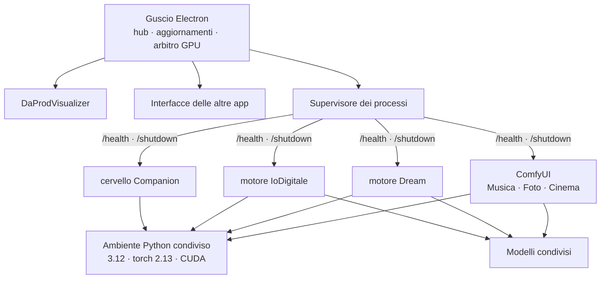

<div align="center">


# DaProd Suite

**I migliori modelli AI, selezionati per te — pronti in due clic.**

Musica, immagini, video, un avatar che ti risponde, e altro ancora nel tempo.
Ogni scheda è un'esperienza completa che installi, usi e disinstalli quando vuoi.
Tutto sul tuo computer, codice aperto.

[](https://github.com/cammo22/DaProdSuite/releases)
[](LICENSE)
[](#requisiti)
[](https://cammo22.github.io/DaProdSuite/)
[](https://github.com/cammo22/DaProdSuite/wiki)


**[⬇ Scarica l'ultima versione](https://github.com/cammo22/DaProdSuite/releases/latest)** ·
**[🌐 Sito](https://cammo22.github.io/DaProdSuite/)** ·
**[📖 Wiki](https://github.com/cammo22/DaProdSuite/wiki)**

</div>

---

<div align="center">

</div>

---

## Chi siamo

Ogni giorno esce un modello nuovo. Noi di DaProd li proviamo, buttiamo via
quelli che non valgono, e montiamo i migliori in un'interfaccia pensata
apposta per loro — che tu sia un professionista che cerca un risultato serio,
o qualcuno che vuole solo divertirsi mezz'ora. **DaProd Suite** è dove
mettiamo quello che troviamo. A disposizione di tutti.

Ogni scheda è **un'esperienza completa**: il modello, l'interfaccia fatta apposta
per lui, e i suoi trucchi già configurati. La installi, la usi, e se non ti serve
più la disinstalli e ti riprendi lo spazio. Niente ambienti da gestire, niente
comandi, niente file di configurazione.

E siccome girano tutte nello stesso posto, si parlano: il brano che generi con
una lo apri nell'altra senza esportare niente.

### Cosa c'è sotto

Perché due clic bastino, la suite si prende in carico le cose noiose una volta
sola per tutte le app:

| | |
|---|---|
| **Un ambiente solo** | Python e PyTorch installati una volta, 4 GB invece di 14,7 sparsi in quattro copie |
| **Modelli condivisi** | quello che serve a due app si scarica una volta |
| **Una GPU sola** | su 8 GB ci sta un modello per volta: la suite spegne il precedente invece di farti finire in out-of-memory |
| **Aggiornamenti** | la suite si aggiorna da sola, i modelli restano dove sono |
| **I tuoi risultati in comune** | brani, immagini e video in una libreria che tutte le app vedono |

Tutto in locale: nessun account, nessuna API, nessun dato che esce dal computer.

## Le app

| | App | Cosa fa | Modello | |
|---|---|---|---|---|
| 🟣 | **DaProdVisualizer** | La tua musica diventa visualizzazioni reattive | — | ✅ disponibile |
| 🩷 | **DaProdMusica** | Canzoni complete e cantate, da una riga d'idea | MiniMax Music 3 | ✅ disponibile |
| 🟠 | **DaProdFoto** | Immagini da prompt e ritocco con maschera | Anima Turbo · FLUX.2 Klein | ✅ disponibile |
| 🩵 | **DaProdDream** | Webcam, video, schermo — o solo un prompt — trasformati in tempo reale | SD-Turbo · Anima | ✅ disponibile |
| 🟥 | **DaProd IoDigitale** | Il tuo avatar parlante: gli scrivi, ti risponde in video | SoulX-FlashHead | ✅ disponibile |
| 🟪 | **DaProdCinema** | Da una canzone al suo video musicale, scena per scena | MiniMax H3 · LTX 2.5 | ⏳ in arrivo |
| 🟢 | **DaProdCompanion** | Un compagno sul desktop che ti ascolta e si ricorda di te | un modello a scelta via LM Studio | ⏳ in arrivo |

Questa non è una lista chiusa: continuiamo a testare modelli nuovi e ad
aggiungere schede. Quello che vedi qui è dove siamo adesso, non dove ci
fermiamo.

Musica, Foto e le altre parlano tutte con lo stesso **modello che scrive** —
qualunque cosa tu tenga aperta in [LM Studio](https://lmstudio.ai), noi
consigliamo [Bonsai 27B](https://lmstudio.ai/models/prism-ml/bonsai-27b) — per
abbozzare titoli, testi e descrizioni quando non sai da dove cominciare.

## A che punto siamo

> **0.1.0 — le prime app sono già operative, e si usano davvero ogni giorno.**
>
> **DaProdVisualizer, DaProdMusica, DaProdFoto, DaProdDream** e **DaProd
> IoDigitale** girano nella suite: si installano da sole (motore e modelli
> compresi, con ripresa se la rete cade), scrivono nella stessa libreria e si
> scambiano i risultati. In DaProdFoto e DaProdDream si sceglie **con quale
> modello** generare; in DaProdMusica e DaProdFoto un modello locale (**Bonsai**,
> o qualunque cosa tu tenga in LM Studio) scrive la canzone o la descrizione al
> posto tuo, se glielo chiedi. Ogni app ha un terminale con le ultime righe del
> motore, e l'hub ha i pannelli per vedere tutti i risultati, tutti i modelli e
> tutti i log in un posto solo.
>
> Restano **DaProdCinema** e **DaProdCompanion**: esistono come progetti
> funzionanti fuori dalla suite e vengono migrati uno alla volta, ognuno provato
> prima di passare al successivo. Nell'hub dicono «In arrivo», e lo dicono sul
> serio — non aprono niente finché non è vero.

Quello che cambia a ogni giro sta in [CHANGELOG.md](CHANGELOG.md), il percorso
completo in [docs/ROADMAP.md](docs/ROADMAP.md).

---

## Requisiti

Testiamo tutto su schede **NVIDIA serie RTX 4000**, almeno 8 GB di VRAM. Con di
più va meglio. Stiamo lavorando perché in futuro almeno una parte della suite
giri anche solo su CPU — oggi non ancora.

| | Minimo | Consigliato |
|---|---|---|
| Sistema | Windows 10 64 bit | Windows 11 |
| GPU | NVIDIA, 8 GB di VRAM | 12 GB o più |
| RAM | 16 GB | 32 GB |
| Disco | 15 GB (una o due app) | 40 GB (tutte) |

La macchina di riferimento su cui tutto viene misurato è una **RTX 4060 da 8 GB**.
Non è un caso: gli 8 GB sono il vincolo che decide quasi ogni scelta tecnica di
questo progetto.

**Serve Python installato?** No. La suite si scarica da sola Python 3.12 e
PyTorch, in una cartella sua, senza toccare quello che hai già.

## Installazione

Scarica `DaProdSuite-Setup-<versione>.exe` dalle
[Release](https://github.com/cammo22/DaProdSuite/releases) e aprilo. Un clic,
nessuna domanda, nessun permesso di amministratore.

Al primo avvio la suite ti chiede quali app vuoi e ti dice **quanti GB servono
prima di scaricarli**. Prendi solo quello che usi.

### Dal codice

```bash
git clone https://github.com/cammo22/DaProdSuite.git
```

```bash
cd DaProdSuite && pnpm install && pnpm run dev
```

Serve [Node.js 22+](https://nodejs.org) e [pnpm](https://pnpm.io). Su Windows
puoi anche fare doppio clic su `AVVIA DaProd Suite.bat`, che fa tutto da sé.

---

## Com'è fatta



Tre idee, e tutto il resto discende da queste.

**Un ambiente solo.** Python e PyTorch si installano una volta e li usano tutti i
motori. Prima erano quattro installazioni con quattro versioni diverse di torch.

**Un patto solo.** Ogni motore ascolta su `127.0.0.1`, risponde `200` su
`/health` quando è pronto e si spegne su `/shutdown`. Rispettato questo, lo shell
non ha bisogno di sapere altro — ed è il motivo per cui lo stesso supervisore
gestisce motori scritti in modi molto diversi.

**Un modello alla volta sulla GPU.** Con 8 GB non ce ne stanno due. Chi vuole la
GPU la chiede all'arbitro, che spegne il precedente. Senza questo, aprire Foto
mentre gira Musica finisce in out-of-memory.

### Dove finiscono le cose

```
C:\Program Files\DaProd Suite\        il programma, sostituito a ogni aggiornamento
%LOCALAPPDATA%\DaProdSuite\
  ├─ runtime\      Python 3.12 + PyTorch          ~4 GB
  ├─ engines\      ComfyUI e altri motori
  ├─ models\       i pesi, condivisi fra le app   fino a ~27 GB
  ├─ output\       brani, immagini, video
  └─ logs\         un file per componente
```

Aggiornare la suite tocca solo la prima riga. **I tuoi modelli e i tuoi risultati
non vengono mai riscaricati né cancellati**, nemmeno disinstallando.

### Quanto spazio serve

| App | Primo avvio | Extra a richiesta |
|---|---|---|
| DaProdVisualizer | — | |
| DaProdDream | 2,6 GB | +5,6 GB per sognare con Anima |
| DaProdFoto | 5,6 GB | +6,3 GB FLUX.2 Klein 4B · +12,0 GB il 9B |
| DaProdMusica | 8,0 GB | +5,6 GB per le copertine con Anima* |
| DaProd IoDigitale | 10,4 GB | +6,0 GB modello Pro |

<sub>* zero se hai già DaProdFoto o DaProdDream: i pesi di Anima sono gli stessi,
condivisi.</sub>

Più ~4 GB di ambiente Python, una volta sola. Gli extra sono qualità migliore in
cambio di spazio: la suite non li scarica se non glielo chiedi, e i byte sono
quelli veri — misurati sul file, non stimati.

---

## Dal telefono


Inquadri un QR e usi la suite dal telefono o dal tablet — sulla stessa wifi, o da
fuori casa attraverso un tunnel che si accende a mano.

Il QR non contiene una password permanente: contiene un invito che **scade in
cinque minuti** e vale una volta sola. Ogni dispositivo ottiene la sua credenziale,
con i suoi permessi, revocabile da sola. I motori restano su `127.0.0.1` e non
sono mai raggiungibili da fuori: passa tutto da un gateway che autentica.

Progetto completo: [docs/ACCESSO-REMOTO.md](docs/ACCESSO-REMOTO.md) — in arrivo
con la 0.4, l'app Android con la 0.5.

---

## Perché va veloce su 8 GB

Alcune scelte misurate, non ipotizzate:

**W4A8 invece dei GGUF a 4 bit.** Pesano uguale, ma sulla stessa GPU: **5-7
frame/s contro 1**. ComfyUI-GGUF dequantizza i pesi a ogni passo — irrilevante per
la diffusione, disastroso per un decoder autoregressivo che fa 25 passi per
secondo di musica.

**Decode a blocchi.** Su 120 secondi di musica: 15 minuti invece di 20, e la VRAM
non esplode.

**La copertina prima del brano.** L'immagine costa venti secondi, la musica
minuti: si genera prima l'artwork, così mentre la musica lavora hai già qualcosa
davanti.

**Il modello base non è il più grande.** DaProdFoto parte con Anima (5,6 GB,
veloce) invece di FLUX.2 Klein (12,4 GB, al limite della VRAM). FLUX resta a un
clic di distanza per quando la qualità conta.

Il ragionamento completo è in
[docs/MODELLI-E-STRATEGIA.md](docs/MODELLI-E-STRATEGIA.md).

---

## Documentazione

| | |
|---|---|
| [CHANGELOG.md](CHANGELOG.md) | Cosa è cambiato, dall'ultima volta in giù |
| [COME-SI-LAVORA.md](docs/COME-SI-LAVORA.md) | Regole della repo, versioni, come si aggiunge un'app |
| [MODELLI-E-STRATEGIA.md](docs/MODELLI-E-STRATEGIA.md) | Quali modelli, quanto pesano, cosa si è compattato |
| [VERIFICA-AMBIENTE-UNIFICATO.md](docs/VERIFICA-AMBIENTE-UNIFICATO.md) | La prova che i quattro motori girano su un solo torch |
| [ACCESSO-REMOTO.md](docs/ACCESSO-REMOTO.md) | QR, gateway, app Android |
| [ROADMAP.md](docs/ROADMAP.md) | Dove si sta andando |
| [RIPRENDERE-DA-QUI.md](docs/RIPRENDERE-DA-QUI.md) | Stato del lavoro e prossimo passo, fra una sessione e l'altra |

## Sviluppo

```bash
pnpm install
```

```bash
pnpm run dev
```

```bash
pnpm run typecheck
```

```bash
pnpm run dist
```

`dist` produce l'installer in `installer/`. La struttura:

```
apps/shell/        il guscio: hub, aggiornamenti, supervisore, arbitro GPU
apps/<app>/        un'interfaccia per app
packages/ipc/      catalogo delle app e contratti tipizzati
packages/runtime/  creazione dell'ambiente Python condiviso
packages/ui/       design condiviso
services/<id>/     i motori Python
manifest/          catalogo dei modelli: URL, dimensioni, a chi servono
```

Aggiungere un'app è una procedura di sei passi, scritta in
[COME-SI-LAVORA.md](docs/COME-SI-LAVORA.md) § 4.

---

## Ringraziamenti

La suite non addestra nulla: mette insieme il lavoro di altri e lo rende usabile.

| | |
|---|---|
| [ComfyUI](https://github.com/comfyanonymous/ComfyUI) | il motore di inferenza di Musica, Foto e Cinema — GPL-3.0, scaricato a parte |
| [MiniMax](https://github.com/MiniMax-AI) | Music 3 per la musica, H3 per il video |
| [Anima](https://huggingface.co/circlestone-labs/Anima) · [FLUX.2 Klein](https://huggingface.co/unsloth/FLUX.2-klein-9B-GGUF) · [LTX 2.5](https://github.com/Lightricks/LTX-Video) | le immagini e il video |
| [SoulX-FlashHead](https://huggingface.co/Soul-AILab/SoulX-FlashHead-1_3B) · [LeapTalk](https://huggingface.co/z-rx/leaptalk) | l'avatar parlante |
| [SD-Turbo](https://huggingface.co/stabilityai/sd-turbo) | la trasformazione in tempo reale |
| [Whisper](https://github.com/SYSTRAN/faster-whisper) · [Piper](https://github.com/rhasspy/piper) | ascoltano e parlano, in locale |
| [LM Studio](https://lmstudio.ai) | il modello che scrive, in ogni app che lo usa |
| [WanGP](https://github.com/deepbeepmeep/Wan2GP) | non è usato dalla suite, ma le sue tecniche di memoria sono state la scuola |

I modelli mantengono ognuno la propria licenza: si scaricano dalle loro fonti, non
sono ridistribuiti qui.

## Community

**In arrivo un Discord**: aggiornamenti, idee, e dove chiedere una mano. Nel
frattempo, [Issue](https://github.com/cammo22/DaProdSuite/issues) e
[Wiki](https://github.com/cammo22/DaProdSuite/wiki) sono i posti giusti.

## Licenza

[MIT](LICENSE) — il codice della suite. I motori e i modelli di terze parti hanno
le loro licenze, elencate qui sopra.

<div align="center">

**DaProdProduzioni**

</div>
