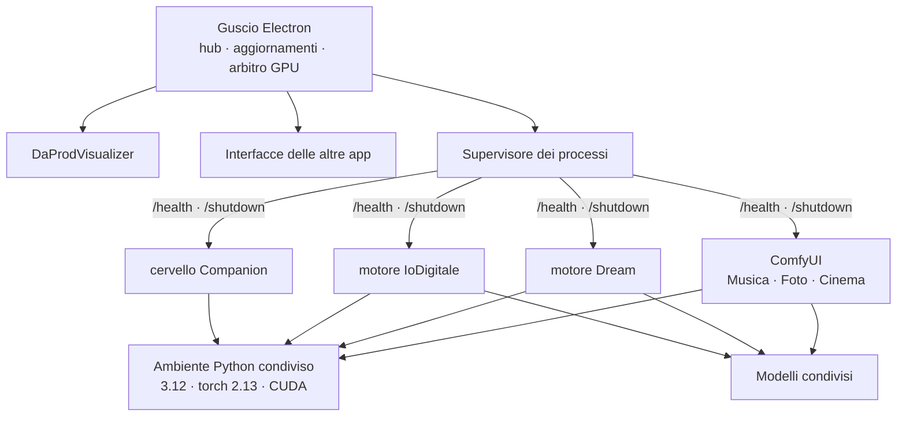

<div align="center">


# DaProd Suite

**I migliori modelli AI, selezionati per te — pronti in due clic.**

Un programma solo per fare musica, immagini, video, voci e parlare con un avatar.
Ogni app la installi quando ti serve e la disinstalli quando non ti serve più.
Gira sul tuo computer: niente account, niente chiavi API, codice aperto.

[](https://github.com/cammo22/DaProdSuite/releases/latest)
[](LICENSE)
[](#requisiti)
[](https://cammo22.github.io/DaProdSuite/)
[](https://cammo22.github.io/DaProdSuite/#domande)


**[⬇ Scarica per Windows](https://github.com/cammo22/DaProdSuite/releases/latest)** ·
**[📱 L'app per il telefono](https://github.com/cammo22/DaProdSuite/releases/latest)** ·
**[🌐 Sito](https://cammo22.github.io/DaProdSuite/)** ·
**[❓ Domande frequenti](https://cammo22.github.io/DaProdSuite/#domande)**

</div>

---

<div align="center">

</div>

---

## Chi siamo

Di modelli ne esce uno al giorno. Noi di DaProd li proviamo, scartiamo quelli
che non valgono, e a quelli buoni costruiamo intorno un'app che li renda usabili
senza sapere niente di come funzionano. **DaProd Suite** è dove finiscono. Serve
sia a chi ci lavora sia a chi vuole solo provarli.

Ogni app fa una cosa sola e la fa per intero: la installi quando ti serve, la
disinstalli quando non ti serve più. Non c'è niente da configurare, nessun
ambiente da preparare, nessun comando da lanciare.

E siccome girano tutte nello stesso posto, i risultati sono in comune: il brano
che fai in un'app lo apri nell'altra senza esportarlo.

### Cosa c'è sotto

Perché bastino due clic, la suite fa una volta sola — per tutte le app — le
cose noiose:

| | |
|---|---|
| **Un ambiente solo** | Python e PyTorch installati una volta, 4 GB invece di 14,7 sparsi in quattro copie |
| **Modelli condivisi** | quello che serve a due app si scarica una volta |
| **Una GPU sola** | su 8 GB ci sta un modello per volta: la suite spegne il precedente invece di farti finire in out-of-memory |
| **Aggiornamenti** | la suite si aggiorna da sola, i modelli restano dove sono |
| **I tuoi risultati in comune** | brani, immagini e video in una libreria che tutte le app vedono |

Tutto in locale: nessun account, nessuna API, nessun dato che esce dal computer.

## Le app

| | App | Cosa fa | Modello | |
|---|---|---|---|---|
| 🟣 | **DaProdVisualizer** | Ascolti un file audio e lo vedi: la grafica si muove col suono | — | ✅ disponibile |
| 🩷 | **DaProdMusica** | Crei canzoni intere, cantate e suonate, da un testo e uno stile | MiniMax Music 3 · ACE-Step 1.5 | ✅ disponibile |
| 🟠 | **DaProdFoto** | Crei immagini scrivendo cosa vuoi vedere, poi ne cambi un pezzo | Anima Turbo · FLUX.2 Klein | ✅ disponibile |
| 🩵 | **DaProdDream** | Trasformi un video mentre scorre: webcam, un file, o lo schermo | SD-Turbo · Anima | ✅ disponibile |
| 🟥 | **DaProdIoDigitale** | Carichi la foto di un volto e ci parli: ti risponde a voce | LeapTalk | ✅ disponibile |
| 🟪 | **DaProdCinema** | Video con il suono dentro, da una descrizione o da un'immagine | LTX 2.5 · MiniMax H3 | ✅ disponibile |
| 🟡 | **DaProdVoce** | Scrivi una frase e te la legge, con la voce che scegli tu | Audio8 TTS 0.1B · 0.6B | ✅ disponibile |
| 🟢 | **DaProdCompanion** | Un assistente sul desktop che si ricorda delle conversazioni di prima | un modello a scelta via LM Studio | ⏳ in arrivo |
| 🔵 | **DaProdConnessione** | Chi è collegato, cosa sta girando, e la stessa pagina che vedi dal telefono | — | ✅ disponibile |

Questa non è una lista chiusa: continuiamo a testare modelli nuovi e ad
aggiungere schede. Quello che vedi qui è dove siamo adesso, non dove ci
fermiamo.

### Se colleghi un LLM

Alcune app possono scrivere al posto tuo: il testo di una canzone, la
descrizione di un'immagine. Per farlo serve un modello LLM caricato in
[LM Studio](https://lmstudio.ai) — **qualunque modello**, la suite usa quello
che trova. Noi lavoriamo con
[Spark X2.5 4B](https://huggingface.co/XHToken/Spark-X2.5-4B-GGUF), caricato a
64K di contesto: è nato per il mestiere che gli chiediamo — leggere le azioni
della suite e riempirne i campi — e sta in un paio di giga, che su una scheda
da 8 è quello che conta. Non è obbligatorio, e senza LLM le app funzionano
tutte lo stesso.

## A che punto siamo

**Ultima pubblicata: 0.9.0 — «Il telefono trova il computer».** La più grossa
da quando esiste l'app del telefono, e cambia il primo minuto: non c'è più un
codice da farsi dettare. Scegli come ti chiami, e sotto compare l'elenco dei
computer di casa; ne tocchi uno, di là arriva un avviso, e chi ci sta davanti
dice di sì.

Dentro ci sono anche il lettore con la fila e il visualizer, gli stili e i
prompt che si condividono in DaProd, la casella «dillo e basta» che trasforma
una frase in un lavoro, e tre difetti dell'app chiusi guardando dentro la
pagina invece che indovinando: il crash che se la portava via, il computer che
si perdeva cambiando indirizzo, e il tasto indietro che usciva dall'app.

**Prima, la 0.8.1 — «Il fotogramma, la foto, e le parole sotto».** La causa vera
delle anteprime dei video: FFmpeg scriveva su un file `.part` e sceglie il
formato dall'estensione, quindi rifiutava — 1269 volte, in silenzio. E i
commenti sotto alle cose in bacheca.


**Prima, la 0.8.0 — «Le cose lasciate indietro».** Sette difetti rimandati
mentre si costruiva il resto: il nome del brano da Android, i modelli che
scrivevano in napoletano, la foto del profilo che non si caricava, le notifiche
in ritardo, la riga delle persone, gli stili.


### Le versioni prima di questa

| | |
|---|---|
| **0.8.1** | La causa vera delle anteprime dei video, la cache della foto, e i commenti |
| **0.8.0** | Sette cose lasciate indietro: anteprime, titolo del brano, italiano, foto del profilo, notifiche |
| **0.7.8** | Gli stili diventano tre — immagini, video, musica — e la barra del telefono torna una riga |
| **0.7.7** | Provata a lungo: il collegamento non si perde più, la fila ha i numeri, venti cose viste usandola |
| **0.7.6** | Due facce per la stessa pagina: chi governa dal computer, chi fa dal telefono. E lo specchio offline |
| **0.7.5** | Da fuori casa davvero: il tunnel si accende da sé e il telefono impara l'indirizzo nuovo |
| **0.7.0** – **0.7.4** | DaProdConnessione, i lavori che partono davvero, i video che arrivano interi |
| **0.6.0** | Il telefono *è* la suite: una sola interfaccia, servita dal computer |
| **0.5.x** | La suite non è più solo quel computer: gateway, azioni, QR, app Android |
| **0.4.x** | DaProdCinema, DaProdVoce, un secondo modo di fare musica |
| **0.1.0** – **0.3.x** | Le fondamenta, l'installer, e le prime sei app |


Quello che cambia a ogni giro sta in [CHANGELOG.md](CHANGELOG.md), il percorso
completo in [docs/ROADMAP.md](docs/ROADMAP.md).

---

## Requisiti

Proviamo tutto su schede **NVIDIA serie RTX 4000** con almeno 8 GB di VRAM. Di
più è meglio.

**Senza scheda video la suite parte lo stesso**, e adesso te lo dice in faccia
invece di lasciartelo scoprire: DaProdDream, DaProdIoDigitale e DaProdCinema
non si installano nemmeno (fanno video, e senza scheda non è "più lento", è
un'altra cosa), DaProdMusica avvisa che un brano può richiedere ore, e in
DaProdFoto resta acceso il modello che ce la fa.

| | Minimo | Consigliato |
|---|---|---|
| Sistema | Windows 10 64 bit | Windows 11 |
| GPU | NVIDIA, 8 GB di VRAM | 12 GB o più |
| RAM | 16 GB | 32 GB |
| Disco | 15 GB (una o due app) | 40 GB (tutte) |

La macchina di riferimento su cui tutto viene misurato è una **RTX 4060 da 8 GB**.
Non è un caso: gli 8 GB sono il vincolo che decide quasi ogni scelta tecnica di
questo progetto.

**Serve Python installato?** No. La suite si scarica da sola Python 3.12 e
PyTorch, in una cartella sua, senza toccare quello che hai già.

## Installazione

Scarica `DaProdSuite-Setup-<versione>.exe` dalle
[Release](https://github.com/cammo22/DaProdSuite/releases) e aprilo. Un clic,
nessuna domanda, nessun permesso di amministratore.

Al primo avvio la suite ti chiede quali app vuoi e ti dice **quanti GB servono
prima di scaricarli**. Prendi solo quello che usi.

**E l'app per il telefono**, dalla stessa Release:
`DaProdSuite-telefono-<versione>.apk`. Non sta su nessun negozio — si installa a
mano, una volta — e da lì in poi si aggiorna da sola. Serve Android 8 o più
recente. Vedi [Dal telefono](#dal-telefono).

### Dal codice

```bash
git clone https://github.com/cammo22/DaProdSuite.git
```

```bash
cd DaProdSuite && pnpm install && pnpm run dev
```

Serve [Node.js 22+](https://nodejs.org) e [pnpm](https://pnpm.io). Su Windows
puoi anche fare doppio clic su `AVVIA DaProd Suite.bat`, che fa tutto da sé.

---

## Com'è fatta



Tre idee, e tutto il resto discende da queste.

**Un ambiente solo.** Python e PyTorch si installano una volta e li usano tutti i
motori. Prima erano quattro installazioni con quattro versioni diverse di torch.

**Un patto solo.** Ogni motore ascolta su `127.0.0.1`, risponde `200` su
`/health` quando è pronto e si spegne su `/shutdown`. Rispettato questo, lo shell
non ha bisogno di sapere altro — ed è il motivo per cui lo stesso supervisore
gestisce motori scritti in modi molto diversi.

**Un modello alla volta sulla GPU.** Con 8 GB non ce ne stanno due. Chi vuole la
GPU la chiede all'arbitro, che spegne il precedente. Senza questo, aprire Foto
mentre gira Musica finisce in out-of-memory.

### Dove finiscono le cose

```
C:\Program Files\DaProd Suite\        il programma, sostituito a ogni aggiornamento
%LOCALAPPDATA%\DaProdSuite\
  ├─ runtime\      Python 3.12 + PyTorch          ~4 GB
  ├─ engines\      ComfyUI e altri motori
  ├─ models\       i pesi, condivisi fra le app   fino a ~27 GB
  ├─ output\       brani, immagini, video
  └─ logs\         un file per componente
```

Aggiornare la suite tocca solo la prima riga. **I tuoi modelli e i tuoi risultati
non vengono mai riscaricati né cancellati**, nemmeno disinstallando.

### Quanto spazio serve

| App | Primo avvio | Extra a richiesta |
|---|---|---|
| DaProdVisualizer | — | |
| DaProdDream | 2,6 GB | +5,6 GB per sognare con Anima |
| DaProdFoto | 5,6 GB | +6,3 GB FLUX.2 Klein 4B · +12,0 GB il 9B |
| DaProdMusica | 13,7 GB | +8,0 GB MiniMax Music 3 · +9,3 GB ACE-Step XL · +5,6 GB per le copertine con Anima* |
| DaProdIoDigitale | 10,4 GB | +6,0 GB modello Pro |
| DaProdCinema | 23,2 GB | +41,6 GB MiniMax H3 |

<sub>* zero se hai già DaProdFoto o DaProdDream: i pesi di Anima sono gli stessi,
condivisi.</sub>

**DaProdCinema è l'unica che costa così tanto**, e non c'è un modo onesto di
farla costare meno: un modello che genera video *con il suono* è un 22B, e i 23
GB sono già la sua versione più compressa che il motore sappia caricare.

Più ~4 GB di ambiente Python, una volta sola. Gli extra sono qualità migliore in
cambio di spazio: la suite non li scarica se non glielo chiedi, e i byte sono
quelli veri — misurati sul file, non stimati.

---

## Dal telefono


Batti un nome e un codice di otto cifre — o inquadri il QR, se preferisci — e la
suite è nel telefono. Il telefono non calcola niente, **fa tutto il computer**, e
per questo anche l'interfaccia sta di là: una sola da tenere allineata, e quando
la suite impara qualcosa il telefono ce l'ha al collegamento dopo.

**Ma non è la stessa faccia.** Dalla 0.7.6 la pagina sa da dove la stai
guardando. Dal telefono, da utente, vedi quello che serve a **fare una cosa**:

- **Casa** — funziona? e cos'è venuto fuori mentre non guardavi;
- **Produzione** — quattro tasti grossi e colorati: immagini, video, musica,
  audio. E, sotto, dieci minuti di chiacchierata con un modello che può
  proporti un piano di lavori;
- **Riepilogo** — quattro numeri e cosa sta girando adesso, con il tuo posto in
  fila;
- **Galleria** — *Le mie Produzioni* e *Pensieri* (le cose che ti hanno
  mandato). Tocchi e si apre a schermo intero, con salva e condividi;
- **DaProd** — la bacheca: quello che gli altri hanno voluto far vedere, con la
  loro faccia, il cuore e il tasto per tenerlo. E il tuo profilo.

Chi è collegato, gli inviti, la rete e i limiti della macchina stanno nella
rotella delle impostazioni — e alcune di quelle cose **si toccano solo dal
computer**.

**All'avvio scegli chi sei.** Più persone sullo stesso telefono, ognuna col suo
collegamento e il suo nome — che è unico: se lo scegli già preso te lo dice
subito.

**Chiedi con il modello che vuoi.** Nel modulo si sceglie fra i modelli veri
delle schede — Anima, Anima v2, FLUX.2 Klein, LTX 2.5, MiniMax H3 — chiamati
come si chiamano, non con il loro id. E ci sono **i tuoi soliti**: un modo di
generare salvato con un nome, che sta sul computer e si ritrova ovunque.

**Vedi le tue cose, e si vedono davvero.** I video hanno il loro fotogramma, i
brani la loro copertina. Della roba degli altri vedi quello che hanno messo in
bacheca; chi sta al computer può mandarti un file quando vuole, e il pacco si
apre nell'app.

**Col computer spento non cambia niente.** Non c'è una schermata di ripiego: è
la stessa app, con quello che il telefono si è tenuto mentre la linea c'era — le
anteprime di tutto, i file che ci stanno, i pensieri arrivati. Quello che chiedi
si mette in coda e parte da solo appena il computer torna, anche ad app chiusa.
E quello che è già in casa si salva in galleria senza rete.

**Sulla wifi di casa, o da fuori.** Con «Anche da fuori casa» acceso la suite
apre un tunnel in uscita e diventa raggiungibile in HTTPS da qualunque parte,
senza aprire porte sul router.

Il QR non contiene una password permanente: contiene un invito che **scade in
cinque minuti** e vale una volta sola. Ogni dispositivo ottiene la sua credenziale,
con i suoi permessi, revocabile da sola. I motori restano su `127.0.0.1` e non
sono mai raggiungibili da fuori: passa tutto da un gateway che autentica.

L'APK sta nella
[Release](https://github.com/cammo22/DaProdSuite/releases/latest), e da lì in poi
**l'app si aggiorna da sola**.

Progetto completo: [docs/ACCESSO-REMOTO.md](docs/ACCESSO-REMOTO.md).

---

## Perché va veloce su 8 GB

Alcune scelte misurate, non ipotizzate:

**W4A8 invece dei GGUF a 4 bit.** Pesano uguale, ma sulla stessa GPU: **5-7
frame/s contro 1**. ComfyUI-GGUF dequantizza i pesi a ogni passo — irrilevante per
la diffusione, disastroso per un decoder autoregressivo che fa 25 passi per
secondo di musica.

**Decode a blocchi.** Su 120 secondi di musica: 15 minuti invece di 20, e la VRAM
non esplode.

**La copertina prima del brano.** L'immagine costa venti secondi, la musica
minuti: si genera prima l'artwork, così mentre la musica lavora hai già qualcosa
davanti.

**Il modello base non è il più grande.** DaProdFoto parte con Anima (5,6 GB,
veloce) invece di FLUX.2 Klein (12,4 GB, al limite della VRAM). FLUX resta a un
clic di distanza per quando la qualità conta.

Il ragionamento completo è in
[docs/MODELLI-E-STRATEGIA.md](docs/MODELLI-E-STRATEGIA.md).

---

## Documentazione

| | |
|---|---|
| [CHANGELOG.md](CHANGELOG.md) | Cosa è cambiato, dall'ultima volta in giù |
| [CONTRIBUTING.md](CONTRIBUTING.md) | Come segnalare qualcosa, e come mettere le mani nel codice |
| [SECURITY.md](SECURITY.md) | Cosa esce dal computer, com'è protetto l'accesso da fuori |
| [COME-SI-LAVORA.md](docs/COME-SI-LAVORA.md) | Regole della repo, versioni, come si aggiunge un'app |
| [MODELLI-E-STRATEGIA.md](docs/MODELLI-E-STRATEGIA.md) | Quali modelli, quanto pesano, cosa si è compattato |
| [VERIFICA-AMBIENTE-UNIFICATO.md](docs/VERIFICA-AMBIENTE-UNIFICATO.md) | La prova che i quattro motori girano su un solo torch |
| [ACCESSO-REMOTO.md](docs/ACCESSO-REMOTO.md) | QR, gateway, DaProdConnessione, tunnel, app Android |
| [ROADMAP.md](docs/ROADMAP.md) | Dove si sta andando |
| [RIPRENDERE-DA-QUI.md](docs/RIPRENDERE-DA-QUI.md) | Stato del lavoro e prossimo passo, fra una sessione e l'altra |

## Sviluppo

```bash
pnpm install
```

```bash
pnpm run dev
```

```bash
pnpm run typecheck
```

```bash
pnpm run dist
```

`dist` produce l'installer in `installer/`. La struttura:

```
apps/shell/        il guscio: hub, aggiornamenti, supervisore, arbitro GPU
apps/<app>/        un'interfaccia per app
apps/mobile/       l'app Android: un vetro sulla console, più quello che una
                   pagina web non sa fare (QR, notifiche, file in galleria)
packages/ipc/      catalogo delle app e contratti tipizzati
packages/azioni/   cosa la suite sa fare, detto una volta sola: la leggono il
                   telefono, la console e l'agente MCP
packages/gateway/  il server dell'accesso da fuori, e la console che serve
packages/mcp/      lo stesso catalogo, per un agente
packages/runtime/  creazione dell'ambiente Python condiviso
packages/ui/       design condiviso
services/<id>/     i motori Python
manifest/          catalogo dei modelli: URL, dimensioni, a chi servono
```

Le prove che girano senza scheda video — cicli, avvio, azioni, gateway, MCP:

```bash
pnpm run prova
```

Aggiungere un'app è una procedura di sei passi, scritta in
[COME-SI-LAVORA.md](docs/COME-SI-LAVORA.md) § 4.

---

## Ringraziamenti

La suite non addestra nulla: mette insieme il lavoro di altri e lo rende usabile.

| | |
|---|---|
| [ComfyUI](https://github.com/comfyanonymous/ComfyUI) | il motore di inferenza di Musica, Foto e Cinema — GPL-3.0, scaricato a parte |
| [MiniMax](https://github.com/MiniMax-AI) · [ACE-Step](https://huggingface.co/ACE-Step) | i due modi di fare una canzone |
| [LTX-2.5](https://huggingface.co/Lightricks/LTX-2.5) · [MiniMax H3](https://huggingface.co/MiniMaxAI/MiniMax-H3) | il video di DaProdCinema, con il suono dentro |
| [Anima](https://huggingface.co/circlestone-labs/Anima) · [FLUX.2 Klein](https://huggingface.co/unsloth/FLUX.2-klein-9B-GGUF) | le immagini |
| [LeapTalk](https://huggingface.co/z-rx/leaptalk) · [SoulX-FlashHead](https://huggingface.co/Soul-AILab/SoulX-FlashHead-1_3B) | l'avatar parlante: LeapTalk gira sopra SoulX, che è il suo modello di base |
| [SD-Turbo](https://huggingface.co/stabilityai/sd-turbo) | la trasformazione in tempo reale |
| [Whisper](https://github.com/SYSTRAN/faster-whisper) · [Piper](https://github.com/rhasspy/piper) | ascoltano e parlano, in locale |
| [opus-mt](https://huggingface.co/Helsinki-NLP/opus-mt-tc-big-it-en) | traduce le descrizioni in inglese prima di generare |
| [LM Studio](https://lmstudio.ai) | tiene acceso l'LLM che scrive testi e descrizioni |
| [WanGP](https://github.com/deepbeepmeep/Wan2GP) | non è usato dalla suite, ma le sue tecniche di memoria sono state la scuola |

I modelli mantengono ognuno la propria licenza: si scaricano dalle loro fonti, non
sono ridistribuiti qui.

## Community

Apriremo un **Discord**: aggiornamenti, richieste, e un posto dove chiedere
aiuto. Per ora si passa da qui:

- [**Qualcosa non funziona**](https://github.com/cammo22/DaProdSuite/issues/new?template=difetto.yml)
  — con il log, che è il primo posto dove guardare;
- [**Un'idea, o una cosa che manca**](https://github.com/cammo22/DaProdSuite/issues/new?template=idea.yml)
  — anche «questa parola non si capisce»: è così che sono nate quasi tutte le
  correzioni di questa suite;
- le domande più comuni hanno già una risposta
  [sul sito](https://cammo22.github.io/DaProdSuite/#domande).

## Licenza

[MIT](LICENSE) — il codice della suite. I motori e i modelli di terze parti hanno
le loro licenze, elencate qui sopra.

<div align="center">

**DaProdProduzioni**

</div>
