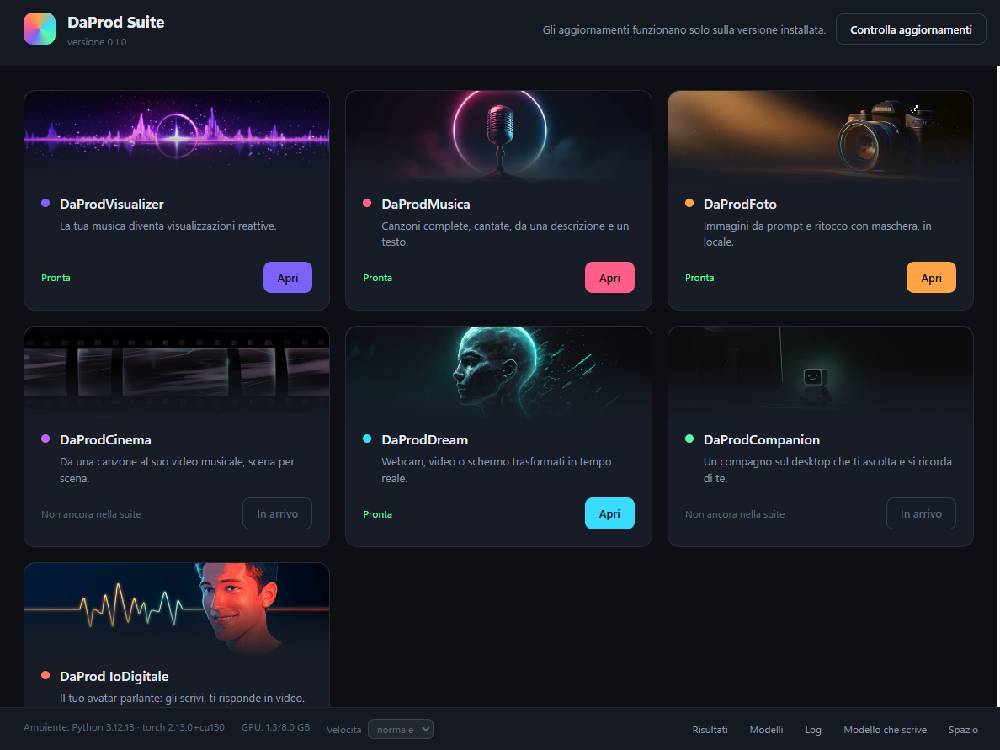
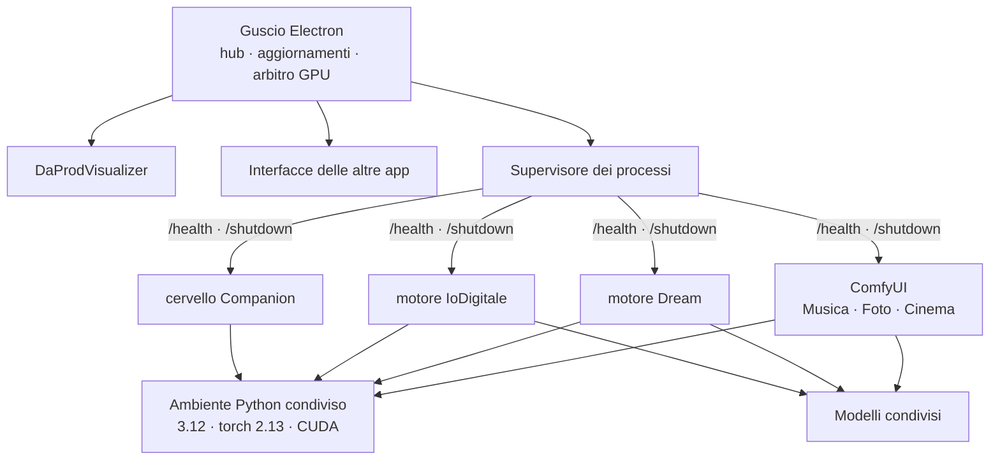

<div align="center">


# DaProd Suite

**I migliori modelli AI, selezionati per te — pronti in due clic.**

Un programma solo per fare musica, immagini, video, voci e parlare con un avatar.
Ogni app la installi quando ti serve e la disinstalli quando non ti serve più.
Gira sul tuo computer: niente account, niente chiavi API, codice aperto.

[](https://github.com/cammo22/DaProdSuite/releases)
[](LICENSE)
[](#requisiti)
[](https://cammo22.github.io/DaProdSuite/)
[](https://cammo22.github.io/DaProdSuite/#domande)


**[⬇ Scarica l'ultima versione](https://github.com/cammo22/DaProdSuite/releases/latest)** ·
**[🌐 Sito](https://cammo22.github.io/DaProdSuite/)** ·
**[❓ Domande frequenti](https://cammo22.github.io/DaProdSuite/#domande)**

</div>

---

<div align="center">

</div>

---

## Chi siamo

Di modelli ne esce uno al giorno. Noi di DaProd li proviamo, scartiamo quelli
che non valgono, e a quelli buoni costruiamo intorno un'app che li renda usabili
senza sapere niente di come funzionano. **DaProd Suite** è dove finiscono. Serve
sia a chi ci lavora sia a chi vuole solo provarli.

Ogni app fa una cosa sola e la fa per intero: la installi quando ti serve, la
disinstalli quando non ti serve più. Non c'è niente da configurare, nessun
ambiente da preparare, nessun comando da lanciare.

E siccome girano tutte nello stesso posto, i risultati sono in comune: il brano
che fai in un'app lo apri nell'altra senza esportarlo.

### Cosa c'è sotto

Perché bastino due clic, la suite fa una volta sola — per tutte le app — le
cose noiose:

| | |
|---|---|
| **Un ambiente solo** | Python e PyTorch installati una volta, 4 GB invece di 14,7 sparsi in quattro copie |
| **Modelli condivisi** | quello che serve a due app si scarica una volta |
| **Una GPU sola** | su 8 GB ci sta un modello per volta: la suite spegne il precedente invece di farti finire in out-of-memory |
| **Aggiornamenti** | la suite si aggiorna da sola, i modelli restano dove sono |
| **I tuoi risultati in comune** | brani, immagini e video in una libreria che tutte le app vedono |

Tutto in locale: nessun account, nessuna API, nessun dato che esce dal computer.

## Le app

| | App | Cosa fa | Modello | |
|---|---|---|---|---|
| 🟣 | **DaProdVisualizer** | Ascolti un file audio e lo vedi: la grafica si muove col suono | — | ✅ disponibile |
| 🩷 | **DaProdMusica** | Crei canzoni intere, cantate e suonate, da un testo e uno stile | MiniMax Music 3 · ACE-Step 1.5 | ✅ disponibile |
| 🟠 | **DaProdFoto** | Crei immagini scrivendo cosa vuoi vedere, poi ne cambi un pezzo | Anima Turbo · FLUX.2 Klein | ✅ disponibile |
| 🩵 | **DaProdDream** | Trasformi un video mentre scorre: webcam, un file, o lo schermo | SD-Turbo · Anima | ✅ disponibile |
| 🟥 | **DaProdIoDigitale** | Carichi la foto di un volto e ci parli: ti risponde a voce | LeapTalk | ✅ disponibile |
| 🟪 | **DaProdCinema** | Video con il suono dentro, da una descrizione o da un'immagine | LTX 2.5 · MiniMax H3 | ✅ disponibile |
| 🟡 | **DaProdVoce** | Scrivi una frase e te la legge, con la voce che scegli tu | Audio8 TTS 0.1B · 0.6B | ✅ disponibile |
| 🟢 | **DaProdCompanion** | Un assistente sul desktop che si ricorda delle conversazioni di prima | un modello a scelta via LM Studio | ⏳ in arrivo |

Questa non è una lista chiusa: continuiamo a testare modelli nuovi e ad
aggiungere schede. Quello che vedi qui è dove siamo adesso, non dove ci
fermiamo.

### Se colleghi un LLM

Alcune app possono scrivere al posto tuo: il testo di una canzone, la
descrizione di un'immagine. Per farlo serve un modello LLM caricato in
[LM Studio](https://lmstudio.ai) — **qualunque modello**, la suite usa quello
che trova. Noi lavoriamo con
[Bonsai 27B](https://lmstudio.ai/models/prism-ml/bonsai-27b) perché l'abbiamo
misurato a fondo, ma non è obbligatorio, e senza LLM le app funzionano tutte
lo stesso.

## A che punto siamo

> **0.7.6: due programmi invece di uno, e il computer che resta tuo.**
>
> **Il telefono ha la sua faccia.** Cinque schede — Casa, **Produzione**,
> **Riepilogo**, Galleria, **DaProd** — e da utente si vede solo quello che
> serve a fare una cosa: quattro tasti grossi e colorati (immagini, video,
> musica, audio), le ultime cose venute fuori, la propria roba a che punto è.
> Tutto quello che governa la macchina è nella rotella delle impostazioni, e
> alcune cose **solo dal computer**.
>
> **Col computer spento non cambia più niente.** Prima l'app mostrava un'altra
> schermata: uscivi di casa e al posto della tua galleria trovavi uno spinner.
> Adesso è la stessa pagina, con quello che il telefono si è tenuto — le
> anteprime di tutto, i file che ci stanno, i pensieri arrivati — e quello che
> chiedi parte da solo appena il computer torna.
>
> **Una registrazione, e un nome che è tuo.** Nome e codice (il QR resta, ma è
> opzionale). Se il nome è già di qualcuno te lo dico subito: da questa versione
> il nome è chi sei in **DaProd**, la bacheca dove le cose hanno un autore, un
> cuore e un tasto per tenerle. C'è il tuo profilo, con la foto, e puoi metterci
> anche roba tua che non ha generato il computer.
>
> **Si vede quello che c'è.** I video hanno il loro fotogramma, i brani la loro
> copertina — cucita **dentro** il file, così si vede anche nel lettore del
> telefono — e toccando una cosa si apre a schermo intero, con salva e
> condividi.
>
> **Dieci minuti con un modello che può usare la suite.** Gli dici cosa
> vorresti, lui prepara un piano — anche una foto e un video insieme — tu spunti
> e dici di sì. Poi il modello se ne va dalla memoria, giusto in tempo perché la
> generazione la usi.
>
> **E il computer resta tuo.** Un turno solo per generazioni e modello (prima
> erano due file che non si conoscevano, ed è il motivo per cui un video moriva
> a metà); chi sta al PC passa davanti; «sto usando il computer» ferma i lavori
> nuovi senza buttare via quelli in corso; e i limiti — chi genera senza
> chiedere, quanti lavori in fila, quanti a testa — **si mettono solo dal PC**.
>
> **La suite si chiude davvero.** Niente più quattro processi da terminare a
> mano nel terminale: si scende per tutto l'albero, e al prossimo avvio si
> spegne quello che è rimasto da una chiusura andata male.
>
> ⚠ Cosa è provato e cosa no sta in fondo al [CHANGELOG](CHANGELOG.md) § 0.7.6.
>
> **0.7.3: i video arrivano, e la scheda video torna libera.**
>
> **Le schede si chiudono quando la fila ha finito**, e con la finestra si
> spegne il motore: su otto GB è la differenza fra la generazione dopo che parte
> e una che non trova posto.
>
> **I video adesso arrivano.** Il file si prende quando ha smesso di crescere, e
> se Windows non lascia rinominarlo si tiene il nome del motore invece di far
> fallire un lavoro finito. E si scaricano a pezzi: un video si scorre senza
> aspettare che arrivi tutto.
>
> **Quello che conta è arrivarci da fuori.** Se da fuori casa non ci si arriva il
> quadrone non è verde, e il QR preferisce l'indirizzo che funziona ovunque.
> Sul telefono **basta il codice**: l'indirizzo si scrive accanto, e sul computer
> c'è scritto cosa copiare.
>
> **Le persone hanno la loro pagina**: Admin o Utente accanto al nome,
> *disconnetti*, e un file da mandare trascinandolo o col tasto. Quello che ti
> mandano finisce **in galleria**.
>
> E: quello che scrivi col computer spento **parte da solo** anche ad app
> chiusa; l'AI scrive anche il testo della canzone.
>
> **0.7.2: ognuno vede le sue cose, e quando arriva una richiesta c'è un menu.**
>
> La galleria non è più di tutti: **ogni cosa prodotta sa chi l'ha chiesta**, e
> ognuno vede le sue. Quello che vuoi far vedere lo metti **in bacheca**, e lì
> compare con scritto chi l'ha fatto — che era la ragione di tutto: vedere chi
> ha fatto quale immagine, ordinati. Vale anche per chi può decidere.
>
> **Chi decide genera subito, chi chiede aspetta un sì**, ed è l'unica
> differenza fra i due. Il permesso adesso si cambia con un tasto in
> DaProdConnessione, senza rifare l'accoppiamento.
>
> **Il menu sulle richieste.** Sotto una richiesta ferma non ci sono più «sì» e
> «no»: c'è *fallo così com'è*, *fallo scrivere meglio e poi fallo*, *scrivila
> io* — e poi mandala con o senza AI — e *no*, con la ragione. Se qualcuno l'ha
> riscritta, resta scritto com'era arrivata.
>
> **I file si chiamano come quello che hai chiesto**, invece di
> `daprod_00042_.png`. **Dal telefono si sceglie il modello** — Anima, FLUX.2,
> LTX 2.5, H3 — e ci sono **i tuoi soliti**, i modi di generare salvati con un
> nome, che stanno sul computer e quindi si vedono da tutte le parti.
>
> E: **trascina un file sul nome di una persona collegata e glielo mandi**, con
> il pacco che si apre sul suo telefono. I lavori finiti si mettono via o si
> buttano.
>
> ⚠ Provato con un dispositivo solo: cosa è provato e cosa no sta in fondo al
> [CHANGELOG](CHANGELOG.md) § 0.7.2.
>
> **0.7.0: c'è DaProdConnessione, e quando accetti un lavoro parte davvero.**
>
> Nell'hub c'è un riquadro nuovo: lo apri e vedi **se tutto funziona** — un
> quadrone verde o rosso, e sotto chi è collegato, da dove si arriva e cosa
> manca, col tasto per rimediare accanto al problema. È la stessa pagina che
> vedono il portatile e il telefono: una sola, invece delle due di prima che non
> dicevano mai la stessa cosa. Il pannello «Da fuori» è sparito, nome compreso.
>
> **Accettare un lavoro adesso lo fa partire.** Era il pezzo che mancava da
> sempre: fino a ieri «accettata» voleva dire «l'ho vista», e la generazione la
> dovevi rifare tu al computer. Adesso la suite apre la scheda giusta, le passa
> il lavoro e ti dice quando è pronto.
>
> **Il telefono non perde più il computer.** Il QR porta tutti gli indirizzi —
> Tailscale, la rete di casa, il tunnel — e l'app li prova finché uno risponde.
> Con Tailscale funziona in casa e fuori, cifrato, senza mettere niente su
> Internet.
>
> E: la connessione è **accesa di suo** e si ricorda; un invito può valere per
> dieci persone; il motore **si scalda mentre guardi l'hub**, così le schede si
> aprono subito.
>
> ⚠ **Da provare sul PC vero**, a partire dalla cosa che conta: accettare un
> lavoro dal telefono e vederlo partire. Cosa è provato e cosa no sta in fondo
> al [CHANGELOG](CHANGELOG.md) § 0.7.0.
>
> **0.6.0: il telefono mostra la suite, e la suite esce di casa.**
>
> L'app Android non disegna più moduli suoi: apre **le pagine che il PC serve**
> — le stesse che vede il browser di un portatile — con le schede, la fila e la
> **galleria**. Le immagini si guardano, i video partono e si scorrono, i brani
> si ascoltano: senza scaricarli prima. E quando sul PC compare una scheda
> nuova, sul telefono c'è al collegamento dopo, senza pubblicare un'app.
>
> **All'avvio si sceglie chi sei.** Più persone sullo stesso telefono, ognuna
> col suo collegamento: sul PC la fila dice chi ha chiesto cosa, invece di
> ripetere tre volte il modello del telefono.
>
> **E funziona anche da fuori casa.** Nel pannello «Da fuori» c'è un secondo
> interruttore: acceso, la suite apre un tunnel in *uscita* verso Cloudflare e
> riceve un indirizzo `https://…`. Niente porte da aprire sul router, niente
> account, e da fuori il traffico è **cifrato** — che era la cosa che mancava
> alla 0.5.0. In casa resta in chiaro sulla wifi, e il pannello lo dice.
>
> Nella stessa versione, **DaProdCinema — Storia** si vede lavorare: ogni
> inquadratura ha la sua barra e dice cosa sta facendo, la clip compare nella
> sua riga appena esce, e il film **si cuce da solo** quando l'ultima scena è
> pronta. Modello, formato e misura sono suoi, non presi in prestito dalla
> scheda Crea. E il **modello che scrive si vede pensare**, coi token che
> escono uno a uno.
>
> ⚠ **Da provare sul PC vero**: il tunnel su una linea vera, l'app su un
> telefono, e la Storia contro il motore acceso. Cosa è provato e cosa no sta
> scritto in fondo al [CHANGELOG](CHANGELOG.md) § 0.6.0.
>
> **0.5.0-0.5.2: la suite non è più solo quel computer.** In fondo all'hub c'è
> il pannello **Da fuori**: lo accendi e ti dà un indirizzo e un QR. Da lì
> comandi il PC fisso dal browser di un portatile, dal telefono, o da un'AI —
> c'è un **server MCP** con cui Claude Code guida la suite. Sotto c'è la cosa
> che serviva davvero: **un elenco scritto una volta sola di cosa la suite sa
> fare**, che leggono tutti e tre.
>
> **Chi comanda resta chi sta al PC.** Una richiesta che arriva da fuori non fa
> partire niente da sola: compare nel pannello e tu la accetti o la scarti. Su
> otto GB di scheda video ci sta un modello per volta, e un telefono che può far
> partire quattro generazioni per provare è un computer che non è più tuo.
>
> **0.4.6: c'è la scheda Storia — scrivi cosa deve raccontare, dici quanti
> minuti, e DaProdCinema lo gira un'inquadratura per volta e te lo cuce.**
>
> **DaProdVisualizer, DaProdMusica, DaProdFoto, DaProdDream, DaProdIoDigitale,
> DaProdCinema** e **DaProdVoce** sono nella suite e funzionano. Si installano da sole, motore e
> modelli compresi, e riprendono da dove erano se cade la rete. In DaProdFoto e
> DaProdDream scegli tu con quale modello generare. Ogni app ha un terminale con
> le ultime righe del motore, e nell'hub ci sono i pannelli per vedere risultati,
> modelli, log, memoria video e spazio occupato in un posto solo. **Le app si
> aprono tutte insieme**: si ascolta un brano nel Visualizer mentre l'app che
> l'ha fatto continua a lavorare.
>
> **DaProdCompanion** — un compagno che ti risponde e la notte rilegge quello
> che vi siete detti per ricordarsene — è entrato nella suite con la 0.3.1. Con
> la 0.3.2 i modelli si scaricano **tre volte più in fretta**: quattro
> connessioni insieme invece di una.
>
> Con la 0.3.3 **DaProdFoto fa foto migliori**: da 30 a 50 step come dice chi ha
> fatto il modello, formato e risoluzione a pulsanti (16:9, 9:16, 4:3, 1:1 per
> 480, 720 o 1080p), e le proposte sopra la casella te le scrivi tu — un titolo
> corto, il prompt intero dentro. Premendo Genera la memoria video viene
> liberata da sola da quello che non serve.
>
> Con la 0.4.6 arriva la **Storia**. Ci scrivi in italiano cosa deve
> raccontare — come lo diresti a una persona — e quanti minuti deve durare. Il
> modello che scrive lo spezza in inquadrature, una per una, con il movimento
> di camera e la luce; tu le rileggi e cambi quelle che non ti piacciono; poi
> si generano una alla volta e alla fine **si cuciono in un film solo**. Se
> chiudi a metà, riprende da dov'era.
>
> ⚠ Quanto ci vuole c'è scritto **prima** che tu prema, in ore, e si rifà sui
> tuoi tempi veri appena c'è una scena fatta. Mezz'ora di film è una notte di
> lavoro: si preme la sera e si guarda la mattina.
>
> Sempre nella 0.4.6, **MiniMax H3 parte come si deve**: due pulsanti, *20
> passi* (come il modello è stato addestrato) e *4 passi* (veloce, per provare
> un'idea). Prima partiva dai quattro, e su quel modello i quattro passi si
> vedono nel movimento.
>
> Con la 0.4.5 **puoi chiedere la clip successiva senza rovinare quella in
> corso.** Premere Genera svuota la scheda video — su 8 GB è quello che fa
> entrare 23 GB di modello — ma lo faceva anche mentre il motore stava
> lavorando, e il video in corso moriva all'ultimo passaggio. Adesso, se c'è
> qualcosa in coda, la scheda non si tocca. Nella stessa versione il
> cronometro conta **da quando premi il tasto** e non da quando parte il
> motore, e il cursore della durata di LTX arriva a **20 secondi**.
>
> Con la 0.4.4 **quello che hai già fatto resta dov'è mentre generi.** Il
> pannello dei lavori in corso si rifaceva da capo una volta al secondo, per
> far scorrere il tempo e la barra, e si portava dietro anche i risultati: a
> DaProdCinema un video ripartiva da zero ogni secondo e non c'era verso di
> guardarlo mentre il prossimo generava, a DaProdMusica e DaProdFoto
> ricaricavano copertine e miniature. Adesso no.
>
> Con la 0.4.3 arriva **DaProdVoce**: scrivi una frase e te la legge,
> anche lunga — viene tagliata dove finiscono le frasi e ricucita da sola. E può
> farlo **con la voce che gli dai tu**: un pezzo di audio in cui si sente parlare
> qualcuno, la trascrizione di quello che dice, e quella voce entra nel menu.
> Niente da addestrare. Due modelli: quello piccolo si installa con l'app, quello
> grande (2,39 GB) legge l'italiano tre volte meglio. È anche l'unica app che non
> pretende la scheda video per sé: si apre accanto alle altre invece di
> spegnerle. Sempre nella 0.4.3, **DaProdCinema ha la Galleria** che gli mancava —
> con il tasto che rimette un video fra i riferimenti di MiniMax H3 — **H3 genera
> anche dal solo testo** (prima era l'app a impedirlo, non il modello), e in
> **DaProdFoto** c'è **Anima v2**: Anima cresciuta a 2,9 miliardi di parametri,
> che costa 3,1 GB perché divide con lei text encoder e VAE.
>
> Con la 0.4.2 **DaProdCinema è rifatto da capo.** Il video musicale
> automatico non c'è più: era costruito sopra a una generazione base che non
> aveva mai funzionato. Adesso la scheda fa una cosa sola — scrivi cosa vuoi
> vedere, scegli forma e misura come in DaProdFoto, premi — e il modello si
> sceglie per primo, in cima. **LTX 2.5** parte dal testo e, se vuoi, dal primo e
> dall'ultimo fotogramma; **MiniMax H3** prende immagini, video e audio di
> riferimento, che nel prompt si chiamano per nome (`<Picture 1>`, `<Video 1>`).
> Sempre nella 0.4.2, in **DaProdMusica** il tasto Crea non resta più premuto a
> vuoto: il comando di LM Studio adesso ha una scadenza, e il tasto racconta cosa
> sta facendo mentre lo fa.
>
> Con la 0.4.1 **il modello si sceglie per primo** in DaProdMusica,
> la **lingua del canto** è una fila di pastiglie sopra il testo, il MiniMax a 4
> bit è stato tolto e **DaProdCinema gira con LTX 2.5 o MiniMax H3** al posto di
> Wan 2.2. E quando scarichi un modello da dentro un'app adesso c'è **una barra
> che dice a che punto è**, con la velocità e quanto manca, invece di rimandarti
> all'hub.
>
> Con la 0.3.4 il **ritocco** di DaProdFoto sa rifare anche tutta la foto —
> senza dipingere niente, o dipingendo quello che vuoi tenere e premendo
> **inverti**.
>
> Con la 0.4.0 era arrivata **la settima scheda**, DaProdCinema, che allora
> prendeva una canzone dalla libreria e ne ricavava la scaletta delle
> inquadrature. Quel modo di lavorare è stato tolto nella 0.4.2 — vedi qui sopra —
> perché stava in piedi sopra a una generazione base che non funzionava.
>
> Sempre nella 0.4.0, **DaProdMusica ha un secondo modo di fare una canzone** —
> ACE-Step 1.5, in otto passi invece di trenta, accanto a MiniMax Music 3 — e il
> **traduttore** italiano→inglese risponde alla prima: prima la prima traduzione
> di ogni sessione non rispondeva mai, e dopo due minuti l'app mandava
> l'italiano al modello. Adesso traduce anche meglio.

Quello che cambia a ogni giro sta in [CHANGELOG.md](CHANGELOG.md), il percorso
completo in [docs/ROADMAP.md](docs/ROADMAP.md).

---

## Requisiti

Proviamo tutto su schede **NVIDIA serie RTX 4000** con almeno 8 GB di VRAM. Di
più è meglio.

**Senza scheda video la suite parte lo stesso**, e adesso te lo dice in faccia
invece di lasciartelo scoprire: DaProdDream, DaProdIoDigitale e DaProdCinema
non si installano nemmeno (fanno video, e senza scheda non è "più lento", è
un'altra cosa), DaProdMusica avvisa che un brano può richiedere ore, e in
DaProdFoto resta acceso il modello che ce la fa.

| | Minimo | Consigliato |
|---|---|---|
| Sistema | Windows 10 64 bit | Windows 11 |
| GPU | NVIDIA, 8 GB di VRAM | 12 GB o più |
| RAM | 16 GB | 32 GB |
| Disco | 15 GB (una o due app) | 40 GB (tutte) |

La macchina di riferimento su cui tutto viene misurato è una **RTX 4060 da 8 GB**.
Non è un caso: gli 8 GB sono il vincolo che decide quasi ogni scelta tecnica di
questo progetto.

**Serve Python installato?** No. La suite si scarica da sola Python 3.12 e
PyTorch, in una cartella sua, senza toccare quello che hai già.

## Installazione

Scarica `DaProdSuite-Setup-<versione>.exe` dalle
[Release](https://github.com/cammo22/DaProdSuite/releases) e aprilo. Un clic,
nessuna domanda, nessun permesso di amministratore.

Al primo avvio la suite ti chiede quali app vuoi e ti dice **quanti GB servono
prima di scaricarli**. Prendi solo quello che usi.

### Dal codice

```bash
git clone https://github.com/cammo22/DaProdSuite.git
```

```bash
cd DaProdSuite && pnpm install && pnpm run dev
```

Serve [Node.js 22+](https://nodejs.org) e [pnpm](https://pnpm.io). Su Windows
puoi anche fare doppio clic su `AVVIA DaProd Suite.bat`, che fa tutto da sé.

---

## Com'è fatta



Tre idee, e tutto il resto discende da queste.

**Un ambiente solo.** Python e PyTorch si installano una volta e li usano tutti i
motori. Prima erano quattro installazioni con quattro versioni diverse di torch.

**Un patto solo.** Ogni motore ascolta su `127.0.0.1`, risponde `200` su
`/health` quando è pronto e si spegne su `/shutdown`. Rispettato questo, lo shell
non ha bisogno di sapere altro — ed è il motivo per cui lo stesso supervisore
gestisce motori scritti in modi molto diversi.

**Un modello alla volta sulla GPU.** Con 8 GB non ce ne stanno due. Chi vuole la
GPU la chiede all'arbitro, che spegne il precedente. Senza questo, aprire Foto
mentre gira Musica finisce in out-of-memory.

### Dove finiscono le cose

```
C:\Program Files\DaProd Suite\        il programma, sostituito a ogni aggiornamento
%LOCALAPPDATA%\DaProdSuite\
  ├─ runtime\      Python 3.12 + PyTorch          ~4 GB
  ├─ engines\      ComfyUI e altri motori
  ├─ models\       i pesi, condivisi fra le app   fino a ~27 GB
  ├─ output\       brani, immagini, video
  └─ logs\         un file per componente
```

Aggiornare la suite tocca solo la prima riga. **I tuoi modelli e i tuoi risultati
non vengono mai riscaricati né cancellati**, nemmeno disinstallando.

### Quanto spazio serve

| App | Primo avvio | Extra a richiesta |
|---|---|---|
| DaProdVisualizer | — | |
| DaProdDream | 2,6 GB | +5,6 GB per sognare con Anima |
| DaProdFoto | 5,6 GB | +6,3 GB FLUX.2 Klein 4B · +12,0 GB il 9B |
| DaProdMusica | 13,7 GB | +8,0 GB MiniMax Music 3 · +9,3 GB ACE-Step XL · +5,6 GB per le copertine con Anima* |
| DaProdIoDigitale | 10,4 GB | +6,0 GB modello Pro |
| DaProdCinema | 23,2 GB | +41,6 GB MiniMax H3 |

<sub>* zero se hai già DaProdFoto o DaProdDream: i pesi di Anima sono gli stessi,
condivisi.</sub>

**DaProdCinema è l'unica che costa così tanto**, e non c'è un modo onesto di
farla costare meno: un modello che genera video *con il suono* è un 22B, e i 23
GB sono già la sua versione più compressa che il motore sappia caricare.

Più ~4 GB di ambiente Python, una volta sola. Gli extra sono qualità migliore in
cambio di spazio: la suite non li scarica se non glielo chiedi, e i byte sono
quelli veri — misurati sul file, non stimati.

---

## Dal telefono


Batti un nome e un codice di otto cifre — o inquadri il QR, se preferisci — e la
suite è nel telefono. Il telefono non calcola niente, **fa tutto il computer**, e
per questo anche l'interfaccia sta di là: una sola da tenere allineata, e quando
la suite impara qualcosa il telefono ce l'ha al collegamento dopo.

**Ma non è la stessa faccia.** Dalla 0.7.6 la pagina sa da dove la stai
guardando. Dal telefono, da utente, vedi quello che serve a **fare una cosa**:

- **Casa** — funziona? e cos'è venuto fuori mentre non guardavi;
- **Produzione** — quattro tasti grossi e colorati: immagini, video, musica,
  audio. E, sotto, dieci minuti di chiacchierata con un modello che può
  proporti un piano di lavori;
- **Riepilogo** — quattro numeri e cosa sta girando adesso, con il tuo posto in
  fila;
- **Galleria** — *Le mie Produzioni* e *Pensieri* (le cose che ti hanno
  mandato). Tocchi e si apre a schermo intero, con salva e condividi;
- **DaProd** — la bacheca: quello che gli altri hanno voluto far vedere, con la
  loro faccia, il cuore e il tasto per tenerlo. E il tuo profilo.

Chi è collegato, gli inviti, la rete e i limiti della macchina stanno nella
rotella delle impostazioni — e alcune di quelle cose **si toccano solo dal
computer**.

**All'avvio scegli chi sei.** Più persone sullo stesso telefono, ognuna col suo
collegamento e il suo nome — che è unico: se lo scegli già preso te lo dice
subito.

**Chiedi con il modello che vuoi.** Nel modulo si sceglie fra i modelli veri
delle schede — Anima, Anima v2, FLUX.2 Klein, LTX 2.5, MiniMax H3 — chiamati
come si chiamano, non con il loro id. E ci sono **i tuoi soliti**: un modo di
generare salvato con un nome, che sta sul computer e si ritrova ovunque.

**Vedi le tue cose, e si vedono davvero.** I video hanno il loro fotogramma, i
brani la loro copertina. Della roba degli altri vedi quello che hanno messo in
bacheca; chi sta al computer può mandarti un file quando vuole, e il pacco si
apre nell'app.

**Col computer spento non cambia niente.** Non c'è una schermata di ripiego: è
la stessa app, con quello che il telefono si è tenuto mentre la linea c'era — le
anteprime di tutto, i file che ci stanno, i pensieri arrivati. Quello che chiedi
si mette in coda e parte da solo appena il computer torna, anche ad app chiusa.
E quello che è già in casa si salva in galleria senza rete.

**Sulla wifi di casa, o da fuori.** Con «Anche da fuori casa» acceso la suite
apre un tunnel in uscita e diventa raggiungibile in HTTPS da qualunque parte,
senza aprire porte sul router.

Il QR non contiene una password permanente: contiene un invito che **scade in
cinque minuti** e vale una volta sola. Ogni dispositivo ottiene la sua credenziale,
con i suoi permessi, revocabile da sola. I motori restano su `127.0.0.1` e non
sono mai raggiungibili da fuori: passa tutto da un gateway che autentica.

L'APK sta nella
[Release](https://github.com/cammo22/DaProdSuite/releases/latest), e da lì in poi
**l'app si aggiorna da sola**.

Progetto completo: [docs/ACCESSO-REMOTO.md](docs/ACCESSO-REMOTO.md).

---

## Perché va veloce su 8 GB

Alcune scelte misurate, non ipotizzate:

**W4A8 invece dei GGUF a 4 bit.** Pesano uguale, ma sulla stessa GPU: **5-7
frame/s contro 1**. ComfyUI-GGUF dequantizza i pesi a ogni passo — irrilevante per
la diffusione, disastroso per un decoder autoregressivo che fa 25 passi per
secondo di musica.

**Decode a blocchi.** Su 120 secondi di musica: 15 minuti invece di 20, e la VRAM
non esplode.

**La copertina prima del brano.** L'immagine costa venti secondi, la musica
minuti: si genera prima l'artwork, così mentre la musica lavora hai già qualcosa
davanti.

**Il modello base non è il più grande.** DaProdFoto parte con Anima (5,6 GB,
veloce) invece di FLUX.2 Klein (12,4 GB, al limite della VRAM). FLUX resta a un
clic di distanza per quando la qualità conta.

Il ragionamento completo è in
[docs/MODELLI-E-STRATEGIA.md](docs/MODELLI-E-STRATEGIA.md).

---

## Documentazione

| | |
|---|---|
| [CHANGELOG.md](CHANGELOG.md) | Cosa è cambiato, dall'ultima volta in giù |
| [COME-SI-LAVORA.md](docs/COME-SI-LAVORA.md) | Regole della repo, versioni, come si aggiunge un'app |
| [MODELLI-E-STRATEGIA.md](docs/MODELLI-E-STRATEGIA.md) | Quali modelli, quanto pesano, cosa si è compattato |
| [VERIFICA-AMBIENTE-UNIFICATO.md](docs/VERIFICA-AMBIENTE-UNIFICATO.md) | La prova che i quattro motori girano su un solo torch |
| [ACCESSO-REMOTO.md](docs/ACCESSO-REMOTO.md) | QR, gateway, DaProdConnessione, tunnel, app Android |
| [ROADMAP.md](docs/ROADMAP.md) | Dove si sta andando |
| [RIPRENDERE-DA-QUI.md](docs/RIPRENDERE-DA-QUI.md) | Stato del lavoro e prossimo passo, fra una sessione e l'altra |

## Sviluppo

```bash
pnpm install
```

```bash
pnpm run dev
```

```bash
pnpm run typecheck
```

```bash
pnpm run dist
```

`dist` produce l'installer in `installer/`. La struttura:

```
apps/shell/        il guscio: hub, aggiornamenti, supervisore, arbitro GPU
apps/<app>/        un'interfaccia per app
packages/ipc/      catalogo delle app e contratti tipizzati
packages/runtime/  creazione dell'ambiente Python condiviso
packages/ui/       design condiviso
services/<id>/     i motori Python
manifest/          catalogo dei modelli: URL, dimensioni, a chi servono
```

Aggiungere un'app è una procedura di sei passi, scritta in
[COME-SI-LAVORA.md](docs/COME-SI-LAVORA.md) § 4.

---

## Ringraziamenti

La suite non addestra nulla: mette insieme il lavoro di altri e lo rende usabile.

| | |
|---|---|
| [ComfyUI](https://github.com/comfyanonymous/ComfyUI) | il motore di inferenza di Musica, Foto e Cinema — GPL-3.0, scaricato a parte |
| [MiniMax](https://github.com/MiniMax-AI) · [ACE-Step](https://huggingface.co/ACE-Step) | i due modi di fare una canzone |
| [LTX-2.5](https://huggingface.co/Lightricks/LTX-2.5) · [MiniMax H3](https://huggingface.co/MiniMaxAI/MiniMax-H3) | il video di DaProdCinema, con il suono dentro |
| [Anima](https://huggingface.co/circlestone-labs/Anima) · [FLUX.2 Klein](https://huggingface.co/unsloth/FLUX.2-klein-9B-GGUF) | le immagini |
| [LeapTalk](https://huggingface.co/z-rx/leaptalk) · [SoulX-FlashHead](https://huggingface.co/Soul-AILab/SoulX-FlashHead-1_3B) | l'avatar parlante: LeapTalk gira sopra SoulX, che è il suo modello di base |
| [SD-Turbo](https://huggingface.co/stabilityai/sd-turbo) | la trasformazione in tempo reale |
| [Whisper](https://github.com/SYSTRAN/faster-whisper) · [Piper](https://github.com/rhasspy/piper) | ascoltano e parlano, in locale |
| [opus-mt](https://huggingface.co/Helsinki-NLP/opus-mt-tc-big-it-en) | traduce le descrizioni in inglese prima di generare |
| [LM Studio](https://lmstudio.ai) | tiene acceso l'LLM che scrive testi e descrizioni |
| [WanGP](https://github.com/deepbeepmeep/Wan2GP) | non è usato dalla suite, ma le sue tecniche di memoria sono state la scuola |

I modelli mantengono ognuno la propria licenza: si scaricano dalle loro fonti, non
sono ridistribuiti qui.

## Community

Apriremo un **Discord**: aggiornamenti, richieste, e un posto dove chiedere
aiuto. Per ora si passa dalle
[segnalazioni](https://github.com/cammo22/DaProdSuite/issues), e le domande più
comuni hanno già una risposta
[sul sito](https://cammo22.github.io/DaProdSuite/#domande).

## Licenza

[MIT](LICENSE) — il codice della suite. I motori e i modelli di terze parti hanno
le loro licenze, elencate qui sopra.

<div align="center">

**DaProdProduzioni**

</div>
